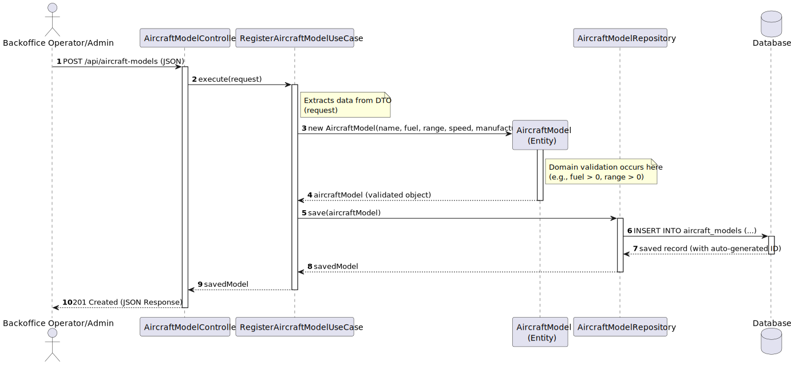

# US 101 - Register Aircraft Model

## 1. Requirements Engineering

### 1.1. User Story Description

As a Backoffice Operator (or Administrator), I want to register a new aircraft model.

### 1.2. Customer Specifications and Clarifications

**From the specifications document:**
> "The AISafe system needs a backend system to manage aircraft configurations... The system must handle thousands of aircraft profiles."
> "Aircraft models must be properly registered with their specific constraints (fuel capacity, maximum range, cruising speed) before individual aircraft instances can be created."

### 1.3. Acceptance Criteria

- **AC101-1:** The aircraft model name (e.g., "B737-800") must be unique across all registered models.
- **AC101-2:** All numeric specifications (fuel capacity, maximum range, cruising speed) must be strictly positive numbers.
- **AC101-3:** The manufacturer must be selected from a predefined list of valid manufacturers (e.g., BOEING, AIRBUS, BOMBARDIER).
- **AC101-4:** The response must return the created resource representation along with HATEOAS navigation links.

### 1.4. Found out Dependencies

- **No dependencies were found.** This is the foundational step for the Aircraft Management module (WP#1A), as an Aircraft Instance (US102) requires an existing Aircraft Model.

### 1.5 Input and Output Data

**Input Data:**
- Typed data via JSON payload (DTO):
    - `modelName` (String)
    - `fuelCapacity` (Integer)
    - `maximumRange` (Integer)
    - `cruisingSpeed` (Integer)
- Selected data:
    - `manufacturer` (Enumeration)

**Output Data:**
- (In)success of the operation (HTTP Status Codes: `201 Created`, `400 Bad Request`, or `409 Conflict`).
- The JSON representation of the registered aircraft model, including its auto-generated ID and RESTful `_links`.

### 1.6. System Sequence Diagram (SSD)

### 1.7 Other Relevant Remarks

- The created aircraft model acts as a catalog template and is ready to be referenced when registering physical aircraft instances (US102).

---

## 2. OO Analysis

### 2.1. Relevant Domain Model Excerpt

### 2.2. Other Remarks

- We extracted `AircraftModel` as a separate Aggregate Root from `Aircraft`. This avoids data duplication, applying the DRY (Don't Repeat Yourself) principle, since multiple physical aircraft share the same technical specifications.
- `AircraftManufacturer` is represented as an enumeration to enforce domain rules strictly (AC101-3).

---

## 3. Design - User Story Realization

### 3.1. Rationale

| Interaction ID | Question: Which class is responsible for... | Answer | Justification (with patterns) |
|:---------------|:--------------------------------------------|:-------|:------------------------------|
| Step 1 | ... interacting with the actor (client)? | `AircraftModelController` | **Controller (REST):** Acts as the entry point for the HTTP request, delegating business logic to the application layer. |
| | ... coordinating the US business flow? | `RegisterAircraftModelUseCase` | **Application Service / UseCase (Clean Architecture):** Orchestrates the process, ensuring the web layer is decoupled from the domain layer. |
| Step 2 | ... receiving and transferring the input data? | `RegisterAircraftModelRequest` | **DTO (Data Transfer Object):** Carries the input data from the Controller to the UseCase without exposing domain entities. |
| Step 3 | ... checking model name uniqueness? | `AircraftModelRepository` | **IE & Repository:** Knows all persisted models in the database and provides methods (e.g., `findByModelName`) to verify uniqueness (AC101-1). |
| Step 4 | ... instantiating a new Aircraft Model? | `AircraftModel` | **Creator:** The entity itself is responsible for its creation. The UseCase simply calls its constructor. |
| | ... validating all domain data (global validation)? | `AircraftModel` | **IE / Rich Domain Model:** Validates its own state (e.g., checking if capacities are > 0) inside its constructor (AC101-2). Prevents invalid states in memory. |
| Step 5 | ... saving the created Aircraft Model? | `AircraftModelRepository` | **Repository:** Abstracts the persistence mechanism (Spring Data JPA) and saves the aggregate to the database. |
| Step 6 | ... informing operation success and providing links? | `AircraftModelController` | **Controller:** Wraps the returned entity into a `ResponseEntity<EntityModel>` adding HTTP 201 status and HATEOAS links. |

### Systematization

According to the taken rationale, the conceptual classes promoted to software classes are:
- `AircraftModel`
- `AircraftManufacturer` (enumeration)

Other software classes (infrastructure and application layers) identified:
- `AircraftModelController` (REST API)
- `RegisterAircraftModelUseCase` (Business Orchestrator)
- `RegisterAircraftModelRequest` (DTO)
- `AircraftModelRepository` (Persistence)

### 3.2. Sequence Diagram (SD)

**Notice that:**
- The REST API flow is kept consistent with Spring Boot MVC standards.
- Uniqueness validation (AC101-1) occurs in the `UseCase` before attempting to create the `AircraftModel` object.
- The `AircraftModel` constructor validates all mandatory fields and business constraints (AC101-2). If validation fails, an `IllegalArgumentException` is thrown and handled globally by the `GlobalExceptionHandler`.
- "Setters" were completely avoided in the domain entity creation to guarantee immutability upon registration.
- Business logic is completely centralized in the Domain and UseCase layers, keeping the Controller thin.